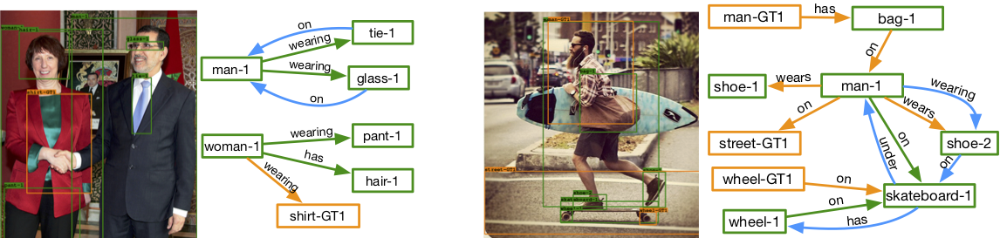

# scg-augmented

## Abstract

Scene graph generation is vital to structuring the information in a visual scene. It is also one of the most challenging tasks to solve in computer vision, requiring an enormous amount of data to learn from. However, the task can benefit from knowledge that is not necessarily in the form of image annotations, but a common knowledge obtained from the likes of a knowledge base or a text corpus.  
This work attempts to study the method of linguistic knowledge distillation []\* , and enhance scene graph generation augmenting with knowledge from various text corpus describing visual scenes and relevant knowledge bases on objects and their spacial relationships.

## Introduction

Scene graphs of visual scenes provide semantic summaries of the various objects and how these objects are related to the others. This structuring is of significance to understanding the contents of an image and is vital to the broader goal of machine visual cogition.  

### Scene Graph Generation

Scene Graph generation (or Visual Relationship Detection) exists in many forms in the current literature.  
[] built a fully connected graph to build an iterative message passing method to learn visual relationships. [] applied reinforcement learning to fine tune graphs built using language priors. [] joinly learned the task of image caption generation, region caption generation and visual relationship detection to leverage information from the caption sources in visual relationship detection.
[Factorizable net] clustered the objects in the image to build richer representations of the objects while [motifs] tried to jointly model various relations in the image to exploit correlations among these visual relations.  
[] used word embeddings to finetune the likelihood of relationship prediction while [] leveraged these in a more structured way using triplet losses on a large scale. [] investigated incorporating prior information in a knowledge distillation framework.

### General Pipeline

The task is to predict the relationship label between two objects in the image, given the object labels, object bounding boxes, and the bounding box enclosing the two objects in question.

For predicting bounding boxes for objects and their labels, standard object detectors are used. Some of the popular and robust object detectors are  

* RCNN
* Fast RCNN
* Faster RCNN

https://github.com/tensorflow/models/tree/master/research/object_detection

There exist a modest number of papers on scene graph generation and good implementations. Some of them are  

https://github.com/Prof-Lu-Cewu/Visual-Relationship-Detection  
https://github.com/yikang-li/MSDN  
https://github.com/shikorab/SceneGraph  
https://github.com/yikang-li/FactorizableNet  
https://github.com/rowanz/neural-motifs  

The most popular datasets experimented with are  

https://visualgenome.org/  
https://cs.stanford.edu/people/ranjaykrishna/vrd/  

### Problems with current work

* Training networks in the visual domain requires a lot more data as compared to others. Even more so in the case of visual relationship detection.
* The number of relations between two objects is quite large and the number of tuples in the training data for a given pair of objects are not sufficient to efficiently train a classifier ground up.

### Side Information

In a particular scene, there could be a large number of objects. But most objects do not have a visual relationship between them. Even if they do, semantically only a few of them make sense as possible candidates. Learning this from data maybe difficult for the relationship classifier to learn while being trained from scratch thanks to the huge relation label space.  

It is crucial to incorporate this kind of information into the model before training it to predict the exact relation to ensure robust predictions in zero shot scenario.  

Text corpora can be a very rich source for this kind of common sense visual information. Paragraoh long descriptions of visual scenes, text from screenplays describing scenes, dense video captions of videos, dialogue about images, image descriptive captions are well suited for this task, particularly if the relevant relation tuples can be extractable by a simple openie system.  

Knowledge bases in the visual domain with relations that are relevant to the task can be leveraged, even more so because of the lack of parsing noise and fine structure.  

## Method

In this work, we explore LK distillation [] in attempt to enhance one of the state-of-the-art methods, neural motifs []. While neural motifs provides the base, LK distillation provides a systematic way of incorporating prior statistical information available in the form of a set of tuples, using a teacher student setup and distilling knowledge from the prior-assisted teacher into the student.

Say there are N object classes, and R relation classes. The prior information is in the form of tuple counts, represented in the form of a tensor of the size NxNxR.  
To obtain a valid probability distribution, this tensor is normalized along the R-axis.  

In general, a teacher network with the same input and output domains, can be constructed independently from the student []. This work however constructs the teacher network on top of the student network and so they share parameters.

If the student network models the probability distribution over the relation classes as  

ps = Ps(r/ox, oy)

and the prior as  

pp = Pp(r/ox, oy)

then the teacher network is constructed as
Pt(r/ox, oy) = Ps(r/ox, oy) * exp ( C * log( Pp(r/ox, oy) ) )

The system is trained with the following objective

min 1/n sigma  alpha * l(si, yi) + (1-alpha) * l(si, ti) 

## Implementation

### Datasets

Visual Genome is one of the largest scene graph datasets available publicly. We subsample the dataset to include a set of 150 objects and 50 relations + _\_\_background\_\__.

By concatenating the image captions from HID Image Captions Dataset, COCO Image Captions dataset and region captions from Visual Genome, we create captions corpora as the source of side information for the construction of priors.

### Scene Graphs

The base model has been directly adapted from the open public implementation of neural motifs [].
The architecture attempts to jointly build embeddings of all objects in the image using an LSTM instead of using an embedder network on each object independently. This is motivated by the presence of recurring subgraphs in the dataset that the paper calls motifs.  

In a nutshell, the pipeline is as follows:
- the object detector network detects the various objects in an image
- the objects are ordered in a sequence in one of the four ways:
	- LeftRight
	- Confidence of prediction of bounding box
	- Descending order of size
	- Random
- this sequence of objects and labels is fed into a decoder LSTM network that outputs contextual embeddings of each of the objects in the image
- every pair of objects are now fed into a classifier that outputs a probability distribution over relation label space

For exact architecture details, refer to the paper / code in the file lib/rel_model.py

### Parsing

For using information from a knowledge base, one needs to consider the subgraph of the knowledge base involving the set of objects and the relations.

For harvesting text corpora, the open domain relation extractor openie was used. https://nlp.stanford.edu/software/openie.html
This module parses sentences and extracts subject-relation-object tuples from sentences. Only the relevant tuples are used to build the prior. Check code: \*  

Another module involving scene graphs built using spacy was used which performed similar scene graphs construction from sentences.  Check code: \*

### Distillation

In a typical teacher student scenario, the teacher network is frozen during the training of the student. The teacher is updated so that it satisfies the KL Divergence constraint from the paper every few iterations. [Knowledge Distillation]  

This particular work designs the teacher so that it satisfies the KL Divergence constraint by construction. And in doing so, in essence, the teacher network is updated every batch. However, in a parameter update step, the gradients flow only through the logits of the student network and not the teacher network.

The two hyper parameters involved are C and alpha which are set to 1.0 and 0.5 respectively unless under .  
These parameters are tuned based on the confidences of the priors obtained from various sources. If the prior is robust enough, tuning parameters should not change the performance too much.

### Evaluation

The models are evaluated with the metric R@N where N = 20, 50, 100

R@N:  
For each of the candidate object pairs, predict the most likely predicate that is not _\_\_background\_\__. This predicted tuple has a score:  
predicate_score * obj_score1 * obj_score2  
where predicate score is the confidence output by the classifier, object scores being the IoU scores wiith the ground truth boxes.  
Consider the top N predictions of the model as per this score.  
Among these, measure recall of the ground_truth tuples among the N candidates.
The score R@N is the average of the recall of various images in the test set.

The score is designed so because, the gold annotations are not guaranteed to be complete and so presence of a tuple in the N candidates that is not in the set of ground_tuples should not decrease the score of a model.  

The models are evaluated in three settings:
1. SGDET: The bounding boxes, object labels and the relation labels are all predicted by the model.
1. SGCLS: The ground truth bounding boxes are used while the object labels and relation labels are predicted by the model.
1. PREDCLS: The ground truth bounding boxes and labels are used while the relation labels are predicted by the model.

Unless specified otherwise, the evaluations are performed in the PREDCLS setting as our objective is to examine the effect of the prior on predicate classification.

## Experiments and Insights

### Parser

The scene_graph parser built on spacy relied on a closed set of verbs in the visual domain. And so, use of an open domain system like openie was more appropriate.

### Verification

It is important to verify that the use of distillation does not hinder the performance of the model. To do so, we compare the following two models:
1. Model with relation biases initialized by the confidences from a prior built out of the dataset and trained in a non-distillation setting.
2. Model with the relation biases initialized randomly, trained in a teacher-student distillation setting with the prior built out of the training dataset.

SGCLS for MOTIFNET-SIZE  

| Model | R@20 | R@50 | R@100 |
| ----- | ---- | ---- | ----- |
| Model1 | 0.322 | 0.350 | 0.357 |
| Model2 | 0.317 | 0.347 | 0.355 |

The performance of Model2 is close to Model1 indicating that the method of distillation is useful to distill information and can be quite powerful when the prior is complementary to the source dataset.

### Lack of Prior Information on "BG" Class

It was observed that for a prior obtained from a corpus, the performance of the model trained in a distillation framework was quite bad as compared to the ones trained either in a non-distillation framework or in a distillation framework with the dataset prior.  

PREDCLS for MOTIFNET-SIZE  

| Model | R@20 | R@50 | R@100 |
| ----- | ---- | ---- | ----- |
| No Bias | 0.582 | 0.649 | 0.668 |
| VG Bias (Dataset Prior) | 0.568 | 0.637 | 0.656 |
| COCO Captions | 0.280 | 0.372 | 0.434 |
| HID Corpus | 0.461 | 0.561 | 0.611 |
| Published | 0.580 | 0.649 | 0.668 |

This was not a hyper parameter tuning issue as the performance dropped gradually as the hyper parameters moved to values that increased the weight of the teacher student divergence cost.  

PREDCLS for MOTIFNET-SIZE on Validation Set  

| COCO Captions | R@20 | R@50 | R@100 |
| ----- | ---- | ---- | ----- |
| 1.0, 0.5 | 0.234 | 0.305 | 0.360 |
| 0.8, 0.5 | 0.282 | 0.356 | 0.404 |
| 0.8, 0.3 | 0.366 | 0.440 | 0.481 |
| 0.0, 0.0 | 0.606 | 0.659 | 0.675 |

The _\_\_background\_\__ label is a special label among the 51 relation labels that indicates that the two objects are not related to each other by any of the available relations and so serves as a leak for probability mass in the classifier.
While the prior obtained from the dataset contains tuples belonging to this relation class, the priors extracted from the corpus do not.  
This information is non trivial to obtain from a corpus as the presence of a tuple does indicate possible relation between the two objects while the absence of the same does not indicate that the objects are unrelated. This is a limitation of an open domain relation extraction system.  
Due to lack of prior confidence for this label, the teacher encouraged the student to not predict the _\_\_background\_\__ label which severly conflicted with the gold labels as a vast majority of the labels in a particular batch were _\_\_background\_\__.

### Bypassing the "BG" Class

Since the _\_\_background\_\__ was quite prominent in the loss term, an inverse class ratio method was tried, where the teacher and gold loss terms for various classes were weighted inversely to the frequency of occurrence in the training dataset.

PREDCLS for MOTIFNET-SIZE

| Model | R@20 | R@50 | R@100 |
| ----- | ---- | ---- | ----- |
| COCO Captions | 0.280 | 0.372 | 0.434 |
| COCO Captions + ICR | 0.198 | 0.275 | 0.330 |
| HID Corpus | 0.461 | 0.561 | 0.611 |
| HID Corpus + ICR | 0.408 | 0.500 | 0.549 |
| Published | 0.580 | 0.649 | 0.668 |

This failed to calibrate the confidence values and presumably added a significant amount of training noise. Exact issues with the approach are not clear in helping towards bypassing the absence of _\_\_background\_\__ class in the prior.

In another attempt, the _\_\_background\_\__ class was completely omitted from training from training and so the weight for the _\_\_background\_\__ class is set to 0.

| Model | R@20 | R@50 | R@100 |
| ----- | ---- | ---- | ----- |
| No Bias | 0.368 | 0.522 | 0.612 |
| VG Bias | 0.341 | 0.471 | 0.551 |
| COCO Captions | 0.394 | 0.515 | 0.577 |
| HID Corpus | 0.302 | 0.448 | 0.540 |
| Published | 0.580 | 0.649 | 0.668 |

While this method does in fact perform worse than the published results (non-distllation setting), the complementary effect of the prior is evident, at least in the case of COCO Captions, where the performance is higher than the scenario where no prior knowledge is distilled into the network. The effect of absence of "bg" class is mitigated, as the performance of the models trained in a distillation setting are not as far away from the No-bias scenario in the previous setting.  

The difference in performance between a model trained in the distillation scenario is higher in the case of lower N values (0.234 for N=20, 0.112 for N=100). This indicates that while the correct tuples are in fact present in the predicted tuples, they do not have a high enough confidence to be ranked higher than the others.  
One possible reason for this behaviour is the lack of leakage of probability mass _\_\_background\_\__. Because the model in this setting is expected to have low confidence values for all classes, in case of absence of a valid non-background label during training, it is also expected that the probability distributions predicted will have higher entropies.  
This is expected to lead to lower confidence values for all non-bg relations and higher ranks for the gold relations.  

### Data-scarcity

The objective of introducing side information is to reduce the dependence on large amounts of gold data and make do with smaller datasets.  

In the following experiment, the number of images in the training set the models are trained on is reduced to 30% and the effect of prior is studied.

PREDCLS for MOTIFNET-SIZE  

| Model | R@20 | R@50 | R@100 |
| ----- | ---- | ---- | ----- |
| No Bias | 0.368 / 0.344 | 0.522 / 0.488 | 0.612 / 0.581 |
| VG Bias | 0.341 / 0.205 | 0.471 / 0.330 | 0.551 / 0.437 |
| COCO Bias | 0.394 / 0.427 | 0.515 / 0.532 | 0.577 / 0.578 |
| HID Bias | 0.302 / 0.209 | 0.448 / 0.334 | 0.540 / 0.444 |
| Published | 0.580 | 0.649 | 0.668 | 

While the prior is expected to reduce the decrease in performance of the models when trained with the smaller dataset, the performance is arbitrary, with an even larger decrease in the case of VG Bias / HID Bias- and an increase in the case of COCO Bias. This may indicate the quality of the prior but definitely needs further investigation.  

## Future Work

While the parsers are powerful enough to extract tuples from sentences where the tuples can be constructed from the dependency graphs of the sentences directly, there are many spacial relations that a particular sentence can imply that cannot be harvested via a dependency parse. For instance, the openie system can extract (boy, is standing under, tree) and (boy, is standing by, his car) from "the boy is standing by his car under a tree" but not (car, standing under, tree). The relation is implied not by dependency structure, but semantics of the spacial world. Constructing such parsers can be hugely beneficial in augmenting scene graph generation.

The presence of _\_\_background\_\__ class is an active issue in the method. This problem can be tackled in two ways, either ensure that the model is calibrated in the absence of training data for the class, or find sources of this prior information from other side information sources if not text corpora.  
Several techniques exist that can ensure confidence values are calibrated right in the absence of "NOTA" training data [cite OOD papers and confidence calibration techniques].
Because of the absence of _\_\_background\_\__ information from text corpora, techniques involving negative sampling motivated by word embeddings could be explored.

In the data-scarce scenario, the effect of prior should be carefully examined by constructing training splits containing complementary information, say splits contain disjoint relations, or relation information among disjoint set of objects. This would help understand how distillation works with information that is orthogonal.  

Methods other than distillation are to be explored. One potential method which can be adopted for this setting is the "confidence calibration method".  

In cases where cheap per image prior information is available, like captions, scene graph generation can be greatly improved. While [large scale vrd] does this, it's heavy reliance on region captions is not justified in a test scenario. Methods relevant to this need to be explored as well.

## References

## Correspondence

Contact details
