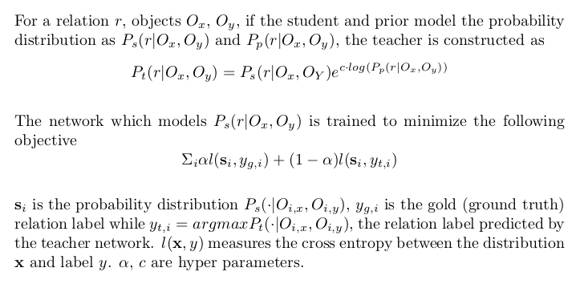

# scg-augmented

## Abstract

Scene graph generation is vital to structuring the information in a visual scene. It is also one of the most challenging tasks in computer vision, requiring an enormous amount of data to learn from. The task can thus benefit from side information, knowledge that is not necessarily in the form of image annotations, but a distribution over the edges of a scene graph obtained from the likes of a relevant knowledge base or a text corpus.  
This work attempts to study the method of [Linguistic Knowledge Distillation](#ref-lkd), and enhance scene graph generation by augmenting with information from various text corpus describing visual scenes, objects and their spatial relationships.

## Introduction

Scene graphs of visual scenes provide semantic summaries of the various objects and how these objects are related to the others. This structuring is of significance to understanding the contents of an image and is vital to the broader goal of machine visual cognition.  

Broadly the task is to detect objects in an image, relations between them and construct a graph representation of the same.  

*
Source: [Rowan Zellers](https://rowanzellers.com/)

### Scene Graph Generation

Scene Graph Generation, or in its most simple form, Visual Relationship Detection exists in many forms in the current literature.  

[Xu, Danfei, et al.](#ref-imp) modeled scene graoh generation as message passing between node and edge graphs. [Liang, et al.](#ref-dvrl) applied reinforcement learning to fine tune graphs built from language priors to capture global dependencies. [Li, Yikang, et al.](#ref-rc) jointly learned the tasks of image caption generation, region caption generation and visual relationship detection to leverage shared feature representations.  
[Li, Yikang, et al.](#ref-fact) clustered the objects in the image to joinly model relations in a cluster using message passing without significant computation cost while [Zellers, Rowan, et al.](#ref-motif) tried to jointly build feature representations for objects to reflect correlations.  
[Lu, Cewu, et al.](#ref-lp) used word embeddings to finetune the likelihood of relationship prediction while [Zhang, Ji, et al.](#ref-lvrd) leveraged these in a more structured way using triplet losses on a large scale. [Yu, Ruichi, et al.](#ref-lkd) investigated incorporating prior information extracted from a text corpus in a [knowledge distillation framework](#ref-distil).

### General Pipeline

The task is to predict the relationship label between two objects in the image, given the object labels, object bounding boxes, and the bounding box enclosing the two objects in question.

For predicting bounding boxes for objects and their labels, standard object detectors are used. Some of the popular and robust object detectors are  

* Faster RCNN
* YOLO

[This blog](https://towardsdatascience.com/r-cnn-fast-r-cnn-faster-r-cnn-yolo-object-detection-algorithms-36d53571365e
) provides details regarding the various archiectures involved and tradeoffs.  

Open source tensorflow implementations are available [here](https://github.com/tensorflow/models/tree/master/research/object_detection).  

There exist a good number of open source good implementations. Some of them are  

* [Prof-Lu-Cewu/Visual-Relationship-Detection](https://github.com/Prof-Lu-Cewu/Visual-Relationship-Detection)
* [yikang-li/MSDN](https://github.com/yikang-li/MSDN)
* [shikorab/SceneGraph](https://github.com/shikorab/SceneGraph)
* [yikang-li/FactorizableNet](https://github.com/yikang-li/FactorizableNet)
* [rowanz/neural-motifs](https://github.com/rowanz/neural-motifs)

The most popular datasets with which scene graph generation is studied with are  

* [Visual Genome](https://visualgenome.org/)
* [VRD](https://cs.stanford.edu/people/ranjaykrishna/vrd/)

### Side Information

In a particular scene, there could be a large number of objects. But most objects are not visually related. Even if they are, semantically only a few of them make sense as possible candidates. Learning this from data may be difficult due to the large relation label space and lack of sufficient training tuples for that particular pair of objects.  

It is crucial to incorporate this kind of "semantic" information into the model not only to ensure robustness, but also reasonable performance in a zero shot scenario.  

Text corpora can be a very rich source of this kind of common sense visual information. Paragraph long descriptions of visual scenes, text from screenplays describing scenes, dense video captions of videos, dialogue about images, image descriptive captions are well suited for this task, particularly if the text is in a straightforward format and relevant relation tuples can be extracted by a simple OpenIE system.  

Knowledge bases in the visual domain with relations that are relevant to the task can also be leveraged, even more so, because of finer structure and lack of parsing noise.  

## Method

In this work, we explore [LK Distillation](#ref-lkd) in attempt to enhance one of the state-of-the-art methods, [Neural-Motifs](#ref-motifs). While neural-motifs provides the baseline, LK Distillation provides a systematic way of incorporating prior statistical information available in the form of a set of tuples, using a teacher-student framework where knowledge is distilled from the prior-assisted teacher into the student.  

In a general [distillation](#ref-distil) framework, a teacher network (with the same input and output domains) can be constructed independently from the student. However, we construct the teacher network with the student network and so they share parameters. The teacher satisfies the kl divergence criterion (see [eq2](#ref-lkd)) by construction. In essence, the teacher network is updated every batch while being independent. In a parameter update step, the gradients flow only through the logits of the student network and not the teacher network.  

Let there be N object classes and R relation classes. The prior information is in the form of tuple counts, represented as a tensor of size NxNxR. For a valid probability distribution, this tensor is normalized along the R-axis.  



## Implementation

### Datasets

[Visual Genome](https://visualgenome.org/) is one of the largest scene graph datasets available publicly. We subsample the dataset to include a set of 150 objects and 50 relations + _\_\_background\_\__. _\_\_background\_\__ is a special relation that indicates that none of the other available labels are suitable for the objects in question.  

Several datasets like [HID](https://cs.stanford.edu/people/ranjaykrishna/im2p/index.html), [COCO](http://cocodataset.org/) have image captions per image. We construct artificial text corpora by concatenating captions from these sources.  

### Scene Graphs

The base model has been directly adapted from the open public implementation of [Neural-Motifs](https://github.com/rowanz/neural-motifs).
The architecture attempts to jointly build embeddings of all objects in the image using an LSTM instead of using an embedder network for each object independently. This is motivated by the presence of recurring subgraphs in the dataset that the paper refers to as motifs.  

In a nutshell, the pipeline is as follows:
- the [object detector](https://github.com/CognitiveHorizons/scg-augmented/blob/911d1e9c8d2cd73478329e9618f6a4c87000fde1/lib/rel_model.py#L340) network detects the various objects in an image
- the objects are ordered in a sequence in one of the four ways:
	- left to right
	- confidence of prediction of bounding box
	- descending order of size
	- random
- this sequence of objects and labels is fed into a decoder LSTM network that outputs [contextual embeddings](https://github.com/CognitiveHorizons/scg-augmented/blob/911d1e9c8d2cd73478329e9618f6a4c87000fde1/lib/rel_model.py#L348) of each of the objects in the image
- every pair of objects is now fed into a [classifier](https://github.com/CognitiveHorizons/scg-augmented/blob/911d1e9c8d2cd73478329e9618f6a4c87000fde1/lib/rel_model.py#L524) that outputs a probability distribution over relation label space

For exact architecture details, refer to the paper and code in the file [lib/rel_model.py](lib/rel_model.py).

### Parsing

For harvesting text corpora, the open domain relation extractor [OpenIE](https://nlp.stanford.edu/software/OpenIE.html) was used.  
This module parses sentences and extracts subject-relation-object tuples from sentences. Only the relevant tuples are used to build the prior. *code to be linked*  

Another open source [scene graph parser](misc/corpus_freq.py) namely [SceneGraphParser](https://github.com/vacancy/SceneGraphParser) built on top of [spacy](https://spacy.io/) performs similar scene graph constructions from sentences. It relies on a closed set of verb phrases to construct tuples among a few other issues. The quality of tuples is observed to be better with OpenIE and so this is not used.

### Distillation

The two hyper parameters involved, c and alpha are set to 1.0 and 0.5 respectively unless specified otherwise. These parameters are tuned based on the confidences of the priors obtained.  

### Evaluation

The models are evaluated with the metric R@N where N = 20, 50, 100  
```
For each of the candidate object pairs, predict the most likely predicate that is not _\_\_background\_\__.

This predicted tuple has a score: predicate_score * obj_score1 * obj_score2  

where predicate score is the confidence output by the classifier, object scores are the IoU scores of the predicted boxes with the ground truth boxes.  

Consider the top N predictions of the model as per this score. Among these, measure recall of the ground truth tuples among the shortlisted candidate tuples.  

The score R@N is the average of this recall for various images in the test set.  
```
The ground truth annotations for an image in a test set are knnown to be incomplete. To ensure this, the score is designed such that the presence of a tuple in the N candidates that is not in the set of ground truth annottaions does not decrease the score of a model.  

The models are evaluated in three settings:
1. SGDET: The bounding boxes, object labels and the relation labels are all predicted by the model.
1. SGCLS: The ground truth bounding boxes are used while the object labels and relation labels are predicted by the model.
1. PREDCLS: The ground truth bounding boxes and labels are used while only the relation labels are predicted by the model.

Unless specified otherwise, the evaluations are performed in the PREDCLS setting as our objective is to examine the effect of the prior on predicate classification.

## Experiments and Insights

### Verification

It is important to verify that the use of distillation does not hinder the performance of the model. To do so, we compare the following two models:
1. Model with relation biases initialized as the confidences from a prior distribution built from the train dataset (hereafter called VG/dataset prior) and trained in a non-distillation setting.
2. Model with the relation biases initialized randomly, trained in a teacher-student distillation setting with VG-Prior.

SGCLS for MOTIFNET-SIZE  

| Model | R@20 | R@50 | R@100 |
| ----- | ---- | ---- | ----- |
| No-Dist | 0.322 | 0.350 | 0.357 |
| Distil | 0.317 | 0.347 | 0.355 |

The performance of Distil is close to No-Dist indicating that the method of distillation is useful to incorporate information. We expect the method to work best whent he prior is complementary to the source dataset.  

### Lack of Prior Information on "BG" Class

It was observed that for a prior obtained from a corpus, the performance of the model trained in a distillation framework was quite bad as compared to the ones trained either in a non-distillation framework or in a distillation framework with the dataset prior. No-Bias is a model where classification biases are initialized randomly and is trained in a non-distillation setting.  

PREDCLS for MOTIFNET-SIZE  

| Model | R@20 | R@50 | R@100 |
| ----- | ---- | ---- | ----- |
| No-Bias | 0.582 | 0.649 | 0.668 |
| VG-Prior | 0.568 | 0.637 | 0.656 |
| COCO | 0.280 | 0.372 | 0.434 |
| HID | 0.461 | 0.561 | 0.611 |
| Published | 0.580 | 0.649 | 0.668 |

This was not a hyper parameter tuning issue as the performance dropped gradually as the hyper parameters moved to values that increased the weight of the teacher student divergence cost.  

PREDCLS for MOTIFNET-SIZE on VAL SET  

| COCO | R@20 | R@50 | R@100 |
| ----- | ---- | ---- | ----- |
| 1.0, 0.5 | 0.234 | 0.305 | 0.360 |
| 0.8, 0.5 | 0.282 | 0.356 | 0.404 |
| 0.8, 0.3 | 0.366 | 0.440 | 0.481 |
| 0.0, 0.0 | 0.606 | 0.659 | 0.675 |

Since _\_\_background\_\__ label stands for "NOTA", it serves as a leak for probability mass in the classifier. It helps confidences reach sufficiently low when a relation label is not appropriate.  

While the prior obtained from the dataset contains tuples belonging to this relation class, the priors extracted from the corpus do not.  

This information is non trivial to obtain from a corpus as the absence of a tuple in the corpus does not indicate that the objects are unrelated.  

Due to lack of prior confidence for this label in this setting, the teacher encouraged the student to not predict the _\_\_background\_\__ label which severely conflicted with the ground truth labels as a vast majority of the labels in a particular batch are _\_\_background\_\__.

### Bypassing the "BG" Class

Since the _\_\_background\_\__ is quite prominent in the loss term, an inverse class ratio (ICR) method was tried where the teacher and ground truth loss terms for various classes are weighted inversely to the frequency of occurrence in the training dataset.

PREDCLS for MOTIFNET-SIZE

| Model | R@20 | R@50 | R@100 |
| ----- | ---- | ---- | ----- |
| COCO | 0.280 | 0.372 | 0.434 |
| COCO + ICR | 0.198 | 0.275 | 0.330 |
| HID | 0.461 | 0.561 | 0.611 |
| HID + ICR | 0.408 | 0.500 | 0.549 |
| Published | 0.580 | 0.649 | 0.668 |

This failed to calibrate the confidence values and presumably added a significant amount of training noise. Exact issues with the approach are not clear in helping towards bypassing the absence of _\_\_background\_\__ class in the prior.  

In another variation, the _\_\_background\_\__ class is completely omitted from training and so the weight for the _\_\_background\_\__ class is set to 0.

| Model | R@20 | R@50 | R@100 |
| ----- | ---- | ---- | ----- |
| No-Bias | 0.354 | 0.509 | 0.602 |
| VG-Prior | 0.128 | 0.259 | 0.399 |
| COCO | 0.117 | 0.238 | 0.369 |
| HID | 0.122 | 0.247 | 0.385 |
| Published | 0.580 | 0.649 | 0.668 |


~~While this method does in fact perform worse than the published results (non-distillation setting), the complementary effect of the prior is evident, at least in the case of COCO, where the performance is higher than the scenario where no prior knowledge is distilled into the network. The effect of absence of _\_\_background\_\__ class is mitigated, as the performance of the models trained in a distillation setting are not as far away from the No-Bias scenario as in the previous setting.~~  

It is evident that distillation here is not helpful at all. One possible cause to this performance is that there is a feedback effect. As the student is training and becomes confident in a particular relation that the prior supports, it is reinforced as long as the training proceeds.  

The difference in performance between a model trained in the distillation scenario is higher in the case of lower N values (0.234 for N=20, 0.112 for N=100). This indicates that while the correct tuples are in fact present in the predicted tuples, they do not have a high enough confidence to be ranked higher than the others.  

One possible reason for this behaviour is the lack of leakage of probability mass into _\_\_background\_\__. In case of absence of an appropriate non-background label, in this setting, the model is expected to produce a flat distribution. This kind of modeling leads to an increase in the average entropy of the model. This means that the predicted labels have lower confidence values leading to higher and close ranking gold relations.  

### Data-scarcity

**Note: Due to a bug found in the codebase (which was fixed), this section is now invalid and is to be updated.**

The objective of introducing side information is to reduce the dependence on large amounts of ground truth data and make do with smaller datasets.  

In the following experiment, the number of images in the training set the models are trained on is reduced to 30%.

PREDCLS for MOTIFNET-SIZE  

| Model | R@20 | R@50 | R@100 |
| ----- | ---- | ---- | ----- |
| No-Bias | 0.368 / 0.344 | 0.522 / 0.488 | 0.612 / 0.581 |
| VG-Prior | 0.341 / 0.205 | 0.471 / 0.330 | 0.551 / 0.437 |
| COCO | 0.394 / 0.427 | 0.515 / 0.532 | 0.577 / 0.578 |
| HID | 0.302 / 0.209 | 0.448 / 0.334 | 0.540 / 0.444 |
| Published | 0.580 | 0.649 | 0.668 | 

While the prior is expected to reduce the decrease in performance of the models when trained with the smaller dataset, the performance is arbitrary, with an even larger decrease in the case of VG-Prior, HID and an increase in the case of COCO. This may indicate the quality of the prior but needs further investigation.  

## Future Work

While the parsers are powerful enough to extract tuples from sentences using dependency graphs, there are many spatial relations that a particular sentence or a document can imply that do not manifest in a parseable form.  
For instance, the OpenIE system can extract (boy, is standing under, tree) and (boy, is standing by, his car) from "the boy is standing by his car under a tree" but not (car, standing under, tree). The relation is implied not by dependency structure, but semantics of the physical world. Constructing such parsers can be hugely beneficial in constructing priors to augment scene graph generation.  

The presence of _\_\_background\_\__ class is an active issue in the method. This problem can be tackled in two ways;
* Ensure that the model is calibrated in the absence of training data for the class. [Out-Of-Distribution Detection](#ref-ood) (directly) and [Calibration](#ref-cal) (indirectly) deal with this exact issue of being able to assert when a particular input is not a part of the source domain.
* Find sources of _\_\_background\_\__ information from other side information sources if not text corpora. Non trivial negative sampling techniques lead by word embeddings could be explored.

In the data-scarce scenario, the effect of prior should be carefully examined by constructing training splits containing complementary information. For insatnce, the split datasets could contain disjoint relation sets, or relations among disjoint set of objects. This would help understand how distillation works with prior information that is complemntary.  

Methods other than distillation are to be explored. One possible direction is to have the model itself be a judge of when to rely on a prior distribution and when not to. [Devries, et al](#ref-conf) provides one possible framework to do this by having the model predict its own confidence estimate.  

In cases where cheap per image prior information like captions is available, scene graph generation can be greatly improved. Methods relevant to this need to be explored as well.

## References

<a id="ref-lkd"></a>
Yu, R., Li, A., Morariu, V.I. and Davis, L.S., 2017. Visual relationship detection with internal and external linguistic knowledge distillation. In Proceedings of the IEEE International Conference on Computer Vision (pp. 1974-1982).

<a id="ref-imp"></a>
Xu, D., Zhu, Y., Choy, C.B. and Fei-Fei, L., 2017. Scene graph generation by iterative message passing. In Proceedings of the IEEE Conference on Computer Vision and Pattern Recognition (pp. 5410-5419).

<a id="ref-dvrl"></a>
Liang, X., Lee, L. and Xing, E.P., 2017. Deep variation-structured reinforcement learning for visual relationship and attribute detection. In Proceedings of the IEEE conference on computer vision and pattern recognition (pp. 848-857).

<a id="ref-rc"></a>
Li, Y., Ouyang, W., Zhou, B., Wang, K. and Wang, X., 2017. Scene graph generation from objects, phrases and region captions. In Proceedings of the IEEE International Conference on Computer Vision (pp. 1261-1270).

<a id="ref-fact"></a>
Li, Y., Ouyang, W., Zhou, B., Shi, J., Zhang, C. and Wang, X., 2018. Factorizable net: An efficient subgraph-based framework for scene graph generation. In Proceedings of the European Conference on Computer Vision (ECCV) (pp. 335-351).

<a id="ref-motif"></a>
Zellers, R., Yatskar, M., Thomson, S. and Choi, Y., 2018. Neural motifs: Scene graph parsing with global context. In Proceedings of the IEEE Conference on Computer Vision and Pattern Recognition (pp. 5831-5840).

<a id="ref-lp"></a>
Lu, C., Krishna, R., Bernstein, M. and Fei-Fei, L., 2016, October. Visual relationship detection with language priors. In European Conference on Computer Vision (pp. 852-869). Springer, Cham.

<a id="ref-lvrd"></a>
Zhang, J., Kalantidis, Y., Rohrbach, M., Paluri, M., Elgammal, A. and Elhoseiny, M., 2018. Large-scale visual relationship understanding. arXiv preprint arXiv:1804.10660.

<a id="ref-distil"></a>
Hinton, G., Vinyals, O. and Dean, J., 2015. Distilling the knowledge in a neural network. arXiv preprint arXiv:1503.02531.

<a id="ref-ood"></a>
Hendrycks, D. and Gimpel, K., 2016. A baseline for detecting misclassified and out-of-distribution examples in neural networks. arXiv preprint arXiv:1610.02136.

<a id="ref-cal"></a>
Guo, C., Pleiss, G., Sun, Y. and Weinberger, K.Q., 2017, August. On calibration of modern neural networks. In Proceedings of the 34th International Conference on Machine Learning-Volume 70 (pp. 1321-1330). JMLR. org.

<a id="ref-conf"></a>
DeVries, T. and Taylor, G.W., 2018. Learning confidence for out-of-distribution detection in neural networks. arXiv preprint arXiv:1802.04865.

## Correspondence

This report is of the work done as a part of an RnD Project, in the Computer Science and Engineering Department of IIT Bombay, India.
For any questions or comments, please email me at *vsreeramdass@gmail.com*.
